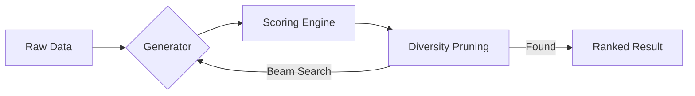

# <p align="center">🛡️ HyperDecode</p>
<p align="center">
  
  
  
  
</p>

<p align="center">
  <strong>Intelligent Heuristic Engine for Multi-Layer De-obfuscation.</strong><br>
  <em>Peel the layers, find the truth with zero latency and absolute precision.</em>
</p>

---

## 📖 Table of Contents
- [🔍 Overview](#-overview)
- [✨ Key Features](#-key-features)
- [🔬 How It Works](#-how-it-works)
- [🚀 Quick Start](#-quick-start)
- [📊 Performance](#-performance)
- [📦 Installation](#-installation)
- [🛤️ Roadmap](#-roadmap)

---

## 🔍 Overview

**HyperDecode** is a sophisticated, AI-like heuristic engine designed for rapid de-obfuscation. While traditional tools require manual step-by-step decoding, HyperDecode explores hundreds of transformation paths simultaneously to uncover the original payload automatically. 

Whether you are a security researcher, a CTF enthusiast, or a developer dealing with complex data, HyperDecode provides the tools to automate the "guesswork" and reach the source data instantly.

> *"A feather-light powerhouse for identifying hidden data structures across infinite layers."*

---

## ✨ Key Features

- 🧠 **Smart Pipeline Search**: Deep heuristic identification of unknown encoding layers.
- ⚡ **High-Speed C Core**: Extreme performance, optimized for massive recursive tasks.
- 🔋 **Feather-Light**: Runs under **32MB RAM** footprint—ideal for low-resource environments.
- 📋 **Recipe System**: Design, save, and batch-apply custom transformation chains.
- ⌨️ **Colorized CLI**: Professional terminal interface with interactive trace and JSON support.
- 🖥️ **Compact GUI**: Streamlined header workspace for maximized data visibility and deep analysis.

---

## 🔬 How It Works

HyperDecode utilizes a **Heuristic Beam Search** algorithm paired with a high-fidelity **Scoring Engine**:

1. **Candidate Generation**: Multiple decoders (Base64, Hex, XOR, Rot, etc.) create potential outputs.
2. **Heuristic Scoring**: Candidates are ranked by Shannon Entropy, Magic Number signatures, and Frequency Analysis.
3. **Diversity Pruning**: The engine ensures a diverse search pool, preventing redundant loops and focusing on high-probability paths.



---

## 🚀 Quick Start

### Deep Search (Automatic)
Automatically hunt for the original payload across multiple layers:
```bash
hyperdecode "SGVsbG8=" --pipeline
```

### Trace Path
Inspect the exact logic steps taken by the heuristic engine:
```bash
hyperdecode input.txt --trace
```

### Automation (JSON)
Integrate HyperDecode into your custom pipelines with clean JSON output:
```bash
hyperdecode data.bin --json > metadata.json
```

---

## 📊 Performance Comparison

| Feature | Standard Tools | HyperDecode |
| :--- | :---: | :---: |
| **Logic Approach** | Manual / Brute-force | **Heuristic Heuristic** |
| **RAM Footprint** | 200MB - 1GB+ | **< 32MB** |
| **Multi-layer Support** | Limited / External | **Native (Heuristic Pipeline)** |
| **Execution Core**| High Level (JS/Python) | **Low Level (C Core)** |

---

## 📦 Installation

### Global CLI Access
1. Download the latest release from the [Releases](#) section.
2. Run the provided automated installer in PowerShell:
   ```powershell
   .\install_cli.ps1
   ```
3. Restart your terminal, and you're ready!

---

## 🛤️ Roadmap
- [ ] **Scripting Engine**: Full Lua & Python plugin integration.
- [ ] **Signature Expansion**: Support for 500+ magic number signatures.
- [ ] **Web Inspection**: Browser-based lightweight extension.

---

**Developed with ❤️ by HyperDecode Team.**  
[Report a Bug](https://github.com/hyperdecode/hyperdecode/issues) • [Request Feature](https://github.com/hyperdecode/hyperdecode/pulls)
