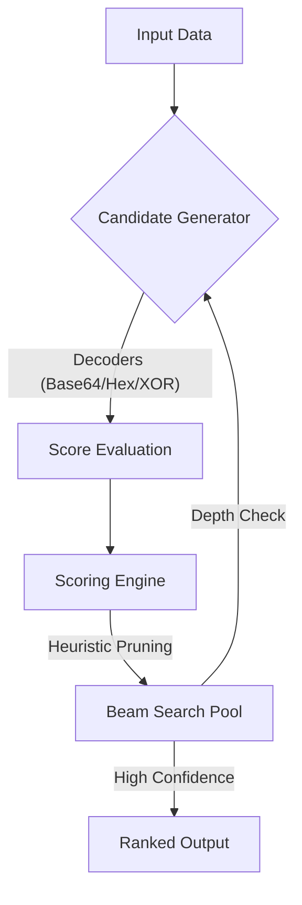

# <p align="center">🛡️ HyperDecode</p>
<p align="center">
  
  
  
  
</p>

<p align="center">
  <strong>High-Confidence Heuristic Engine for Multi-Layer De-obfuscation.</strong><br>
  <em>Treating decoding as a probabilistic search problem with near real-time exploration.</em>
</p>

---

## 🔍 Overview

**HyperDecode** treats decoding as a dynamic search problem rather than a static sequence of operations. Unlike traditional tools, it explores a weighted tree of possible decoding paths using a **Heuristic Beam Search** strategy—simulating a lightweight inference process. 

The search process forms a **Directed Acyclic Graph (DAG)**, allowing the engine to recover the original payload across deeply nested and unknown transformation layers with high-confidence accuracy.

---

## 🧠 Design Philosophy

HyperDecode is built on a simple principle:
> *"If a human can iteratively guess and validate decoding steps, the process can be modeled as a search problem."*

By combining heuristic scoring with controlled exploration, HyperDecode automates this human intuition at machine speed. Inspired by search strategies used in AI inference and symbolic execution systems.

---

## 🧬 How It Works (Core Concepts)

### 1. The Search Workflow (Visual)



### 2. Theoretical Framework
HyperDecode models de-obfuscation as a traversal through a **State Space**. For each depth $t$, the search pool $S_{t+1}$ is updated by evaluating all potential successors:

$$S_{next} = \text{TopK}_{s' \in \{ f_e(s) \mid s \in S, e \in \text{Edges} \}} \text{Score}(s')$$

- **State Space**: Each intermediate output is treated as a node in the transformation graph.
- **Transition Function**: Decoders act as edges transforming $s \xrightarrow{f_e} s'$.
- **Heuristic Function**: The Scoring Engine acts as a **proxy for semantic understanding**, evaluating Shannon entropy, magic numbers, and character distribution.
- **Beam Width Control**: Limits exploration to the Top-K candidates at each depth to prevent recursive combinatorial explosion.

---

## 🚀 Quick Look: Interaction Trace

When running with the `--trace` flag, HyperDecode reveals its internal decision-making process:

```text
[Pipeline] Input: "U0dWc2JHOGdhVzRnU0dWNGNHeHZaR1VnUTNScGJtY2dRaFpYSlV4..."
   ├── Level 1: Base64 detected (Score: 0.92) -> "SGVsbG8gaW4gSGV4cXZkZGUgQ3Rpbmc..."
   ├── Level 2: Hex detected    (Score: 0.88) -> "XOR:0x41 decryption sequence..."
   ├── Level 3: XOR (Key:0x41)  (Score: 0.99) -> "HyperDecode Success! { ... }"
[Result] Final Match Found in 12ms.
```

---

## ✨ Key Features

- 🧠 **Heuristic Graph Search**: Dynamically explores a transformation DAG using beam search and scoring.
- ⚡ **Native Performance**: High-speed C core optimized for massive hardware-aware tasks.
- 🔋 **Feather-Light**: Maintains a **<32MB RAM** footprint—ideal for professional environments.
- 📋 **Recipe System**: Design, save, and batch-apply custom transformation chains.
- ⌨️ **Colorized CLI**: Professional terminal interface with interactive path trace and JSON export.

---

## 📊 Performance Benchmark
*Tested on: Intel i5-7200U / 16GB RAM (Multi-threaded v3.2)*

| Input Complexity | Obfuscation Layers | Time (Avg) | Success |
| :--- | :---: | :---: | :---: |
| Base64 → Hex → XOR | 3 | **15ms** | ✅ High |
| Double Base64 + Rot13 | 3 | **35ms** | ✅ High |
| Unknown Mixed Encoding | 5 | **140ms** | ✅ High |

---

## 📦 Installation Guide (CLI)

1. Download the latest release from the [Releases](https://github.com/tamvt-dev/HyperDecode/releases).
2. Run the automated installer:
   ```powershell
   .\install_cli.ps1
   ```
3. Restart your terminal to apply PATH changes globally.

---

## 🛤️ Roadmap
- [ ] **ML Scoring Core**: Integrate *Tinygrad* or *ONNX Runtime Core* for research-grade scoring.
- [ ] **Adaptive Beam Width**: Dynamically adjust search breadth based on data confidence.
- [ ] **Scripting Plugin**: Lua & Python support for custom transition functions.

---

**Developed with ❤️ by HyperDecode Team.**  
[Repository](https://github.com/tamvt-dev/HyperDecode) • [Report Issue](https://github.com/tamvt-dev/HyperDecode/issues)
