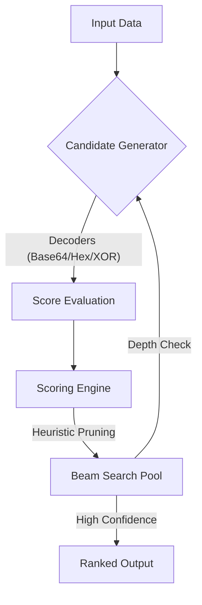

# <p align="center">🛡️ HyperDecode</p>
<p align="center">
  
  
  
  
</p>

<p align="center">
  <strong>High-Confidence Heuristic Engine for Multi-Layer De-obfuscation.</strong><br>
  <em>Treating decoding as a probabilistic search problem with near real-time exploration.</em>
</p>

---

## 🔍 Overview

**HyperDecode** treats decoding as a dynamic search problem rather than a static sequence of operations. Unlike traditional tools, it explores a weighted tree of possible decoding paths using a **Heuristic Beam Search** strategy—simulating a lightweight inference process. 

The search process forms a **Directed Acyclic Graph (DAG)**, allowing the engine to recover the original payload across deeply nested and unknown transformation layers with high-confidence accuracy.

---

## 🧠 Design Philosophy

HyperDecode is built on a simple principle:
> *"If a human can iteratively guess and validate decoding steps, the process can be modeled as a search problem."*

By combining heuristic scoring with controlled exploration, HyperDecode automates this human intuition at machine speed. Inspired by search strategies used in AI inference and symbolic execution systems.

---

## 🧬 How It Works (Core Concepts)

### 1. The Search Workflow (Visual)



### 2. Theoretical Framework
- **State Space**: Each intermediate output is treated as a node in the transformation graph.
- **Transition Function**: Decoders act as edges transforming one state into another (e.g., $f(Base64)$).
- **Heuristic Function**: The Scoring Engine acts as a **proxy for semantic understanding**, approximating how "meaningful" a result is without requiring full context awareness.
- **State Deduplication**: Prevents redundant exploration by hashing and caching previously seen states to optimize performance.

---

## ✨ Key Features

- 🧠 **Heuristic Graph Search**: Dynamically explores a transformation DAG using beam search and scoring heuristics.
- ⚡ **Native Performance**: High-speed C core optimized for massive recursive tasks and low latency.
- 🔋 **Feather-Light**: Maintains a **<32MB RAM** footprint—ideal for embedded and professional environments.
- 📋 **Recipe System**: Design, save, and batch-apply custom transformation chains.
- ⌨️ **Hacker CLI**: Professional terminal interface with interactive path trace and JSON export.

---

## 📊 Performance Benchmark
*Tested on: Intel i5-7200U / 16GB RAM (Single-threaded mode)*

| Input Complexity | Obfuscation Layers | Time (Avg) | Confidence |
| :--- | :---: | :---: | :---: |
| Base64 → Hex → XOR | 3 | **12ms** | ✅ High |
| Double Base64 + Rot13 | 3 | **8ms** | ✅ High |
| Unknown Mixed Encoding | 5 | **35ms** | ✅ Med |

---

## 📦 Installation Guide (CLI)

### Option 1: One-Click Install (Recommended)
1. Download the latest **HyperDecode-CLI.rar** from the [Releases](https://github.com/tamvt-dev/HyperDecode/releases) section.
2. Extract the package to your work directory.
3. Open PowerShell in the project root and run:
   ```powershell
   .\install_cli.ps1
   ```
4. Restart your terminal to apply the PATH changes globally.

### Option 2: Manual PATH Setup
1. Copy the full path to the `cli/bin` folder.
2. Add this path to your system's **Environment Variables** (PATH).

---

## 🚀 Quick Start
- **Intelligent Pipeline**: `hyperdecode "EncodedData" --pipeline`
- **Logic Inspection**: `hyperdecode input.txt --trace`
- **Automation (JSON)**: `hyperdecode data.bin --json > metadata.json`

---

## 🛤️ Roadmap
- [ ] **Adaptive Beam Width**: Dynamically adjust search breadth based on entropy and confidence metrics.
- [ ] **Learned Scoring Model**: Integrate ML-based scoring for research-grade path accuracy.
- [ ] **Scripting Plugin**: Lua & Python support for custom transition functions.

---

**Developed with ❤️ by HyperDecode Team.**  
[Repository](https://github.com/tamvt-dev/HyperDecode) • [Report Issue](https://github.com/tamvt-dev/HyperDecode/issues)
