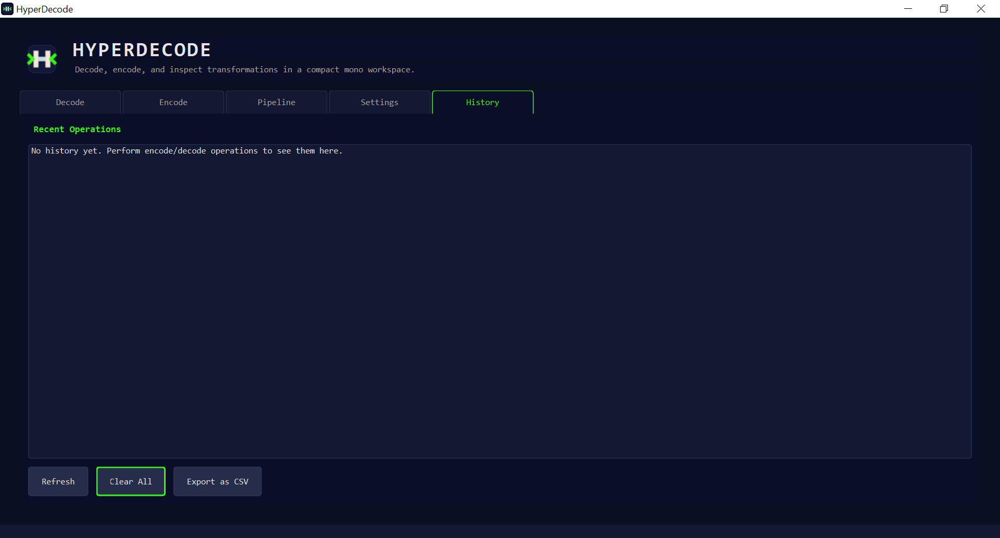
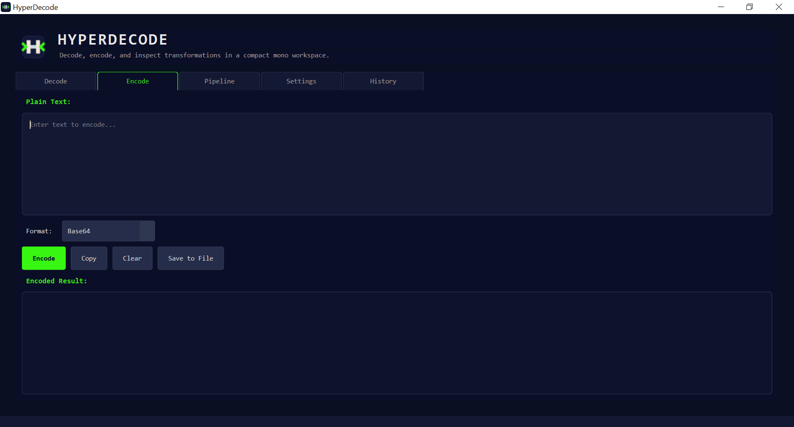
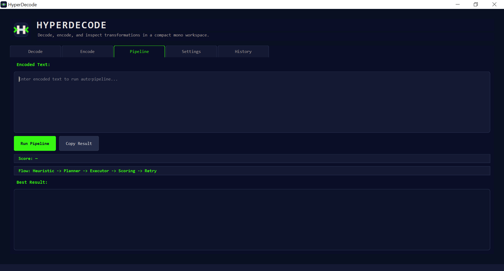

# HyperDecode Beta 2.0

HyperDecode is a Windows desktop app for decoding, encoding, and inspecting transformed text. It is built for cases where you have a string that may be Base64, Hex, Binary, Morse, or a layered combination of multiple encodings and you want the app to help recover the most likely readable result.

In practice, HyperDecode is useful when you are:
- analyzing suspicious or unknown encoded strings
- unpacking multi-layer challenge inputs
- testing how different transforms change text
- quickly converting text between common formats
- tracing which decode path produced the final output

## What The App Does

HyperDecode has two main jobs:

1. Direct transforms
- decode a string when you already know or can guess the format
- encode plain text into Base64, Hex, Binary, or Morse

2. Smart layered recovery
- detect structured input such as binary, hex, base64, morse, and URL-like text
- try multiple decode paths
- score candidate outputs
- keep the route that looks most promising

That makes it different from a simple converter. Instead of only doing one transform, HyperDecode can search through multiple possible layers and show the route it chose.

## Main Features

- `Decode` tab for direct decoding with `Auto Detect` or a selected format
- `Encode` tab for direct encoding
- `Pipeline` tab for layered decoding and route discovery
- dark and light themes
- history tracking for previous decode, encode, and pipeline runs
- plugin-based transforms such as ROT13, Caesar, Atbash, URL, XOR, and Scramble

Built-in structured formats:
- Base64
- Hex
- Binary
- Morse

## How To Use It

### Decode Tab

Use this when you want a quick result for one string.

- paste encoded text
- leave `Auto Detect` selected or choose a specific format
- press `Decode`
- copy the decoded result

This is the fastest path when the input is probably a single known format.

### Encode Tab

Use this when you want to generate encoded output from plain text.

- enter plain text
- choose an output format
- press `Encode`
- copy or save the result

### Pipeline Tab

Use this when the input may be layered, ambiguous, or intentionally confusing.

The pipeline:

```text
Input
-> Fast Heuristic Engine
-> Strategy Engine
-> Multi-Pipeline Executor
-> Scoring Engine
-> Auto Retry + Mutation
-> Best Result
```

What you get in this tab:
- the best output found
- a score for that result
- the route used to get there

This is the main Beta 2.0 feature.

### Settings Tab

Use this to:
- switch dark and light theme
- enable or disable auto-decode
- show or hide notifications
- show or hide the command window
- refresh formats and clear cache

### History Tab

Use this to revisit earlier runs and send previous inputs back into Decode, Encode, or Pipeline.

## Who This Is For

HyperDecode is aimed at:
- CTF and puzzle users
- reverse-engineering and malware-analysis learners
- developers testing encoding pipelines
- anyone dealing with mystery strings copied from logs, payloads, or challenges

## Status

This repository is currently centered on the Qt desktop build.

Current beta highlights:
- Qt Widgets desktop UI
- smart pipeline for multi-layer decoding
- parallel candidate execution
- readability and confidence-based scoring
- retry logic for normalized variants
- Inno Setup installer script for the Qt release build

## Screenshot

Main Qt desktop workspace and feature views:





## Project Layout

```text
HyperDecode/
|-- core/          Core decoding logic, scoring, plugins, pipeline
|-- Qt/            Qt desktop application
|-- installer/     Inno Setup installer files
|-- output/        Installer output folder
|-- portable/      Portable distribution notes and assets
`-- README.md
```

## Requirements

Windows build environment expected by this project:
- Qt 6 Widgets
- MinGW toolchain
- MSYS2 UCRT64 environment
- GLib 2.x

The `.pro` file is currently configured around the local MSYS2 UCRT64 layout.

## Build

### Qt Desktop App

From the `Qt` directory:

```bat
qmake HyperDecode.pro
mingw32-make release
```

Expected output:

```text
Qt\release\HyperDecode.exe
```

## Installer

The installer script for the Qt build is:

```text
installer\setup.iss
```

It is configured to package:
- `Qt\release\HyperDecode.exe`
- Qt runtime DLLs from `Qt\release`
- Qt plugin folders such as `platforms`, `styles`, `imageformats`, and related runtime directories
- application icons from `Qt\icons`

Default installer output:

```text
output\HyperDecode_Setup.exe
```

To build the installer, open `installer\setup.iss` in Inno Setup Compiler and compile it after the Qt release build is ready.

## Notes For Beta 2.0

- this beta is optimized for nested and mixed encoded strings
- pipeline behavior is heuristic-driven and still evolving
- some routes may still require tuning for highly adversarial or intentionally misleading inputs
- the current repository state is focused on the Qt application rather than a polished CLI release

## License

This project includes an MIT license in the repository root:

```text
LICENSE
```
